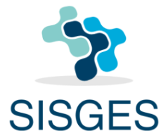

## Sistema Gerador de Escalas de Serviços

  O sistema gerador de escalas de serviços (SISGES), torna o processo de geração de
escalas, realizado pelo bibliotecário, mais ágil e prático. Devido a falta de um sistema para
tal finalidade, o sistema proposto poderá trazer grandes vantagens para o funcionamento
geral da biblioteca, como o funcionamento correto do rodízio de serviços que deve
acontecer, e a agilização do processo de criação de escalas!

1. Termo utilizado no ambiente institucional para caracterizar a guarda temporária de patrimonio.

### Pre-requisitos

* Servidor PHP instalado. Ex.: [XAMPP](https://www.apachefriends.org/download.html) ou [WAMP](http://www.wampserver.com/en/)

### Instalação

### Execução

1. Criar o banco de dados na pasta [sql/](https://github.com/rodrigoaggeu/GP3U/tree/master/sql)
2. Iniciar o servidor PHP
3. Em um navegador acessar pagina [localhost](http://localhost)
4. Acessar o diretório do projeto (pode variar dependendo de qual servidor for ultilizado)

## Desenvolvido com

* [PHP](http://php.net/) - Linguagem de programação utilizada
* [Bootstrap 4](https://getbootstrap.com/) - kit de ferramentas de código aberto para desenvolvimento com HTML, CSS e JS.
* [Java Script](https://www.javascript.com/) - Linguagem de programação interpretada

## Colaboradores

* **Denys Nyckson** - [denysnyckson](https://github.com/denysnyckson)
* **Everton Fernandes** - [evertonfrnds](https://github.com/evertonfrnds)
* **Fernando José** - [fjose123](https://github.com/fjose123)
* **Igor Medeiros** - [deadsubjekt](https://github.com/deadsubjekt)
* **Narciso Farias** - [narcisof](https://github.com/narcisof)

## Responsabilidades + Gerência

### Gerente atual: [fjose123](https://github.com/fjose123)

#### Iteração atual: 5ª

| *Iteração* | *Aluno*     | *Função*      | *Inicio - Fim*          |
| ---------- | ----------- | ------------- | ----------------------- |
| *1*        | *Narciso*   | *Gerente*     |*30/10/2018 - 06/11/2018*|
| 1          | Denys       | Desenvolvedor |                         |
| 1          | Everton     | Desenvolvedor |                         |
| 1          | Fernando    | Desenvolvedor |                         |
| 1          | Igor        | Desenvolvedor |                         |
| -          | -           | -             |                         |
| *2*        | *Igor*      | *Gerente*     |*07/11/2018 - 14/11/2018*|
| 2          | Denys       | Desenvolvedor |                         |
| 2          | Everton     | Desenvolvedor |                         |
| 2          | Fernando    | Desenvolvedor |                         |
| 2          | Narciso     | Desenvolvedor |                         |
| -          | -           | -             |                         |
| *3*        | *Denys*     | *Gerente*     |*15/11/2018 - 22/11/2018*|
| 3          | Narciso     | Desenvolvedor |                         |
| 3          | Everton     | Desenvolvedor |                         |
| 3          | Fernando    | Desenvolvedor |                         |
| 3          | Igor        | Desenvolvedor |                         |
| -          | -           | -             |                         |
| *4*        | *Everton*   | *Gerente*     |*23/11/2018 - 30/11/2018*|
| 4          | Narciso     | Desenvolvedor |                         |
| 4          | Denys       | Desenvolvedor |                         |
| 4          | Fernando    | Desenvolvedor |                         |
| 4          | Igor        | Desenvolvedor |                         |
| -          | -           | -             |                         |
| *5*        | *Fernando*  | *Gerente*     |*01/12/2018 - 04/12/2018*|
| 5          | Narciso     | Desenvolvedor |                         |
| 5          | Denys       | Desenvolvedor |                         |
| 5          | Everton     | Desenvolvedor |                         |
| 5          | Igor        | Desenvolvedor |                         |
| -          | -           | -             |                         |

## Licença

This project is licensed under the MIT License - see the [LICENSE](https://github.com/denysnyckson/SISGES/blob/master/LICENSE) file for details.
